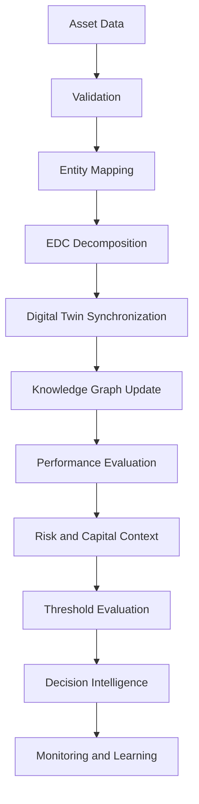

# Asset Intelligence Flow

```mermaid
flowchart TD
    A[Asset Data] --> B[Validation]
    B --> C[Entity Mapping]
    C --> D[EDC Decomposition]
    D --> E[Digital Twin Synchronization]
    E --> F[Knowledge Graph Update]
    F --> G[Performance Evaluation]
    G --> H[Risk and Capital Context]
    H --> I[Threshold Evaluation]
    I --> J[Decision Intelligence]
    J --> K[Monitoring and Learning]
```
