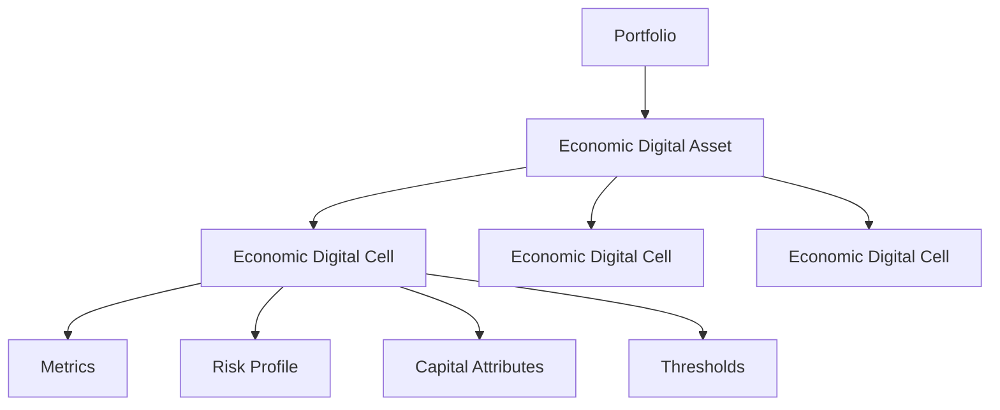

# EDA / EDC Hierarchy

```mermaid
flowchart TD
    P[Portfolio] --> EDA[Economic Digital Asset]
    EDA --> EDC1[Economic Digital Cell]
    EDA --> EDC2[Economic Digital Cell]
    EDA --> EDC3[Economic Digital Cell]
    EDC1 --> M1[Metrics]
    EDC1 --> R1[Risk Profile]
    EDC1 --> C1[Capital Attributes]
    EDC1 --> T1[Thresholds]
```
