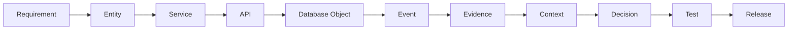

# Traceability Graph

```mermaid
flowchart LR
    REQ[Requirement] --> ENT[Entity]
    ENT --> SVC[Service]
    SVC --> API[API]
    API --> DB[Database Object]
    DB --> EVT[Event]
    EVT --> EVD[Evidence]
    EVD --> CTX[Context]
    CTX --> DEC[Decision]
    DEC --> TEST[Test]
    TEST --> REL[Release]
```
