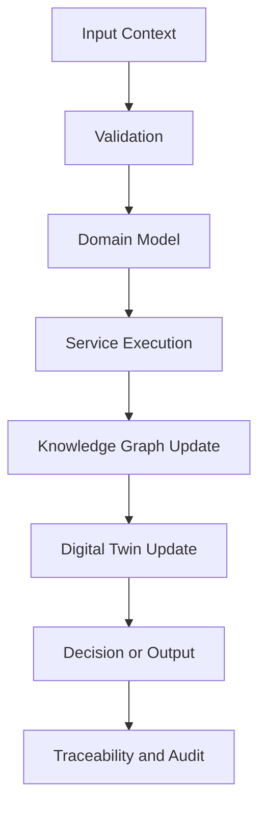

# Decision Intelligence Standard Flow

```mermaid
flowchart TD
    A[Input Context] --> B[Validation]
    B --> C[Domain Model]
    C --> D[Service Execution]
    D --> E[Knowledge Graph Update]
    E --> F[Digital Twin Update]
    F --> G[Decision or Output]
    G --> H[Traceability and Audit]
```
