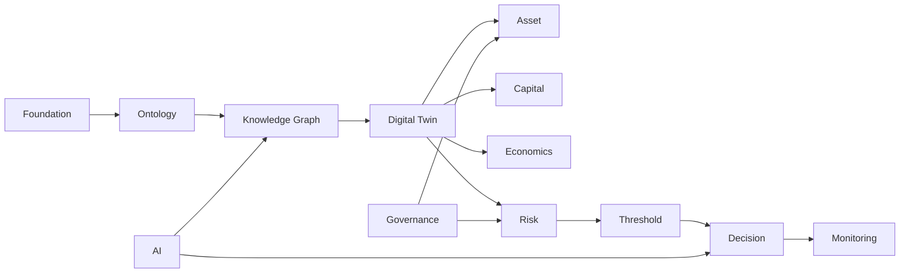

# Domain Decomposition Diagram

```mermaid
flowchart LR
  FND[Foundation] --> ONT[Ontology]
  ONT --> KG[Knowledge Graph]
  KG --> DT[Digital Twin]
  DT --> AST[Asset]
  DT --> CAP[Capital]
  DT --> ECO[Economics]
  DT --> RSK[Risk]
  RSK --> THR[Threshold]
  THR --> DEC[Decision]
  DEC --> MON[Monitoring]
  GOV[Governance] --> AST
  GOV --> RSK
  AI[AI] --> KG
  AI --> DEC
```
