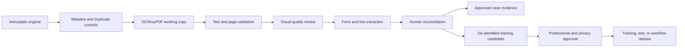

# MAG Audit Organizational Learning, Training, and Enhancement Workflow

## Purpose

Every completed case should improve MAG Audit without allowing unreviewed client data,
OCR errors, or AI opinions to become institutional knowledge. The authoritative client
file remains separate from de-identified training assets.

## Recorded operating workflow

For every document and analytical procedure, the case record captures:

1. **Purpose** — the question the step is intended to answer.
2. **Input** — document ID, immutable hash, source, form, year, and case relationship.
3. **Control gate** — consent, access, malware scan, duplicate check, and authority.
4. **Action** — tool, version, configuration, operator or agent, and time.
5. **Output** — derivative ID, extracted fields, citations, ratios, findings, and exceptions.
6. **Verification** — page count, visual comparison, reconciliation, confidence, and reviewer.
7. **Decision** — accepted, corrected, escalated, superseded, or rejected.
8. **Lesson** — error pattern, successful technique, missing control, and proposed improvement.
9. **Promotion** — approved procedure, training example, regression test, or rule change.

## OCRmyPDF standard operating procedure

- Never overwrite the uploaded file; preserve its hash and custody history.
- Create a searchable PDF and text sidecar in the case working area.
- Record OCRmyPDF configuration, version, output hash, page count, searchable-page rate,
  original size, output size, and compression ratio.
- Use conservative optimization for tax evidence; visual review is mandatory before reliance.
- Compare representative pages containing small print, dollar amounts, checkboxes, and schedules.
- OCR output is a working derivative, not a substitute for the signed or filed source document.

### Pilot lesson 001 — mixed text layers

The first two pilot packages contained scanned pages with existing hidden text and additional
pages without usable text. A selective OCR pass therefore produced an incomplete text sidecar.
The analytical configuration was changed to full-page OCR, while the originals and first-pass
results were retained. This lesson becomes a regression test: all material pages must be
represented in the analytical text output before extraction begins.

The packages also contain both federal Form 1120-S information and Illinois Form IL-1120-ST
material. Classification must operate at the page and subdocument level; a filename or a
single cover page is not sufficient to characterize the full package.

## Controlled learning cycle

Only a reviewed case outcome may become a learning candidate. Before promotion:

1. Remove taxpayer names, identifiers, addresses, bank data, signatures, and preparer data.
2. Confirm that client consent and retention policy permit the intended use.
3. Replace client values with synthetic values when the lesson does not require actual values.
4. Assign reviewer-approved labels for document type, form, year, line values, relationships,
   applicable authority, audit techniques, ratio cohort, finding, and final disposition.
5. Test the candidate against privacy, security, professional, and citation requirements.
6. Approve through a named tax professional and knowledge steward.
7. Release with a version, effective date, change note, test case, and rollback path.

The system never retrains itself directly from raw uploads, AI answers, OCR text, or reviewer
overrides. Those items create proposals that require governed review.

## Reusable organizational assets

- Role-based onboarding and refresher training
- Sanitized case simulations and answer keys
- Document identification and extraction templates
- IRS correspondence and IDR response playbooks
- Industry audit programs and evidence matrices
- SOI cohort and ratio-mapping guides
- Exception, escalation, and taxpayer-rights playbooks
- Regression tests for extraction, calculations, citations, and risk rules
- Decision logs, release notes, and superseded-procedure archive

## Accountability

| Role | Accountability |
|---|---|
| Case professional | Confirms facts, relationships, and reconciliations |
| Tax technical reviewer | Approves authority, technique, and tax conclusions |
| Knowledge steward | Curates taxonomy, citations, versions, and training assets |
| Privacy/security reviewer | Approves de-identification, access, and retention |
| Product owner | Prioritizes enhancements and accepts release criteria |
| AI/OCR agent | Proposes classifications and extractions; never provides final approval |

## Performance and enhancement measures

Track OCR searchable-page rate, visual defect rate, field accuracy, reconciliation exceptions,
false-positive and false-negative findings, citation coverage, reviewer time, turnaround time,
compression ratio, override rate, repeat errors, and client-value outcomes. A metric may trigger
an enhancement proposal, but it may not silently change a production rule.
