# MAG Audit pilot document-to-risk workflow

## User outcome

After one or more returns are uploaded, MAG Audit answers:

1. What did we receive?
2. Do the files belong to the same taxpayer, related taxpayers, or different cases?
3. Are they original, amended, duplicate, prior-year, or related-return packages?
4. What schedules and supporting records are present or missing?
5. Which values were extracted, reconciled, and professionally confirmed?
6. Which taxpayer and SOI aggregate ratios are relevant?
7. Which IRS audit techniques apply to the form, industry, facts, and evidence gaps?
8. What is the explainable review-priority risk, and what should happen next?

## Governed workflow graph

```mermaid
flowchart LR
    A["Upload returns and support"] --> B["Preserve immutable originals"]
    B --> C["Malware scan and duplicate hash"]
    C --> D["OCR and document identification"]
    D --> E{"Identity and relationship confirmed?"}
    E -- No --> F["Human exception review"]
    F --> E
    E -- Yes --> G["Extract form, year, schedules and canonical values"]
    G --> H["Professional value confirmation"]
    H --> I["Return and evidence reconciliation"]
    I --> J["Taxpayer ratios and multiyear trends"]
    J --> K["Select SOI form, industry, year and size cohort"]
    K --> L["SOI aggregate ratio context"]
    I --> M["Retrieve applicable ATG and IRM techniques"]
    L --> N["Explainable risk and readiness assessment"]
    M --> N
    N --> O["Customized audit program and evidence requests"]
    O --> P["CPA/director review"]
    P --> Q["Client report, remediation and case plan"]
```

## Current two-file pilot

The two 2022 uploads are mixed federal and Illinois S-corporation packages. They include
Form 1120-S information and Illinois Form IL-1120-ST material, so the workflow must split
and classify subdocuments before federal and IDOR procedures are selected.

The local pilot contains two distinct scanned PDF packages in case
`PCASE-3A965EB605`:

- Burbank package: 18 pages, 2022 Form 1120-S package visually identified.
- School package: 20 pages, 2022 Form 1120-S package visually identified.

Both are image-only scans. Automated text extraction correctly stopped because
neither has searchable text or AcroForm values. Full local OCR and human identity
confirmation are the next gates. Sensitive taxpayer identifiers must be masked in
the UI, logs, agent prompts, and deliverables unless specifically authorized.

## Ratio layers

### Taxpayer calculations

- Gross margin = (business receipts - cost of goods sold) / business receipts
- Net margin = ordinary business income / business receipts
- Officer compensation / receipts
- Wages / receipts
- Rent / receipts
- Advertising / receipts
- Depreciation / receipts
- Inventory / total assets
- Receivables / receipts
- Current ratio and other supportable balance-sheet measures
- Year-over-year dollar and percentage changes

Every result carries its return line, extracted value, reviewer, formula, period,
and reconciliation status. Missing denominators produce `not_computable`, not zero.

### IRS SOI comparison

Use Publication 16 aggregate cells selected by tax year, form family, NAICS/industry,
and the most defensible size dimension available. Show source table, aggregate return
count, value, formula, and limitations. SOI aggregates are context, not return-level
percentiles, IRS tolerances, or audit-selection thresholds.

## Risk output

Keep four results separate:

- examination exposure indicators;
- documentation/readiness score;
- potential financial magnitude;
- review priority.

Each risk contribution must link to observed facts, evidence, technique, authority,
rule version, weight, confidence, reviewer, and override history. The system must not
describe review priority as the probability that the IRS will audit the return.
